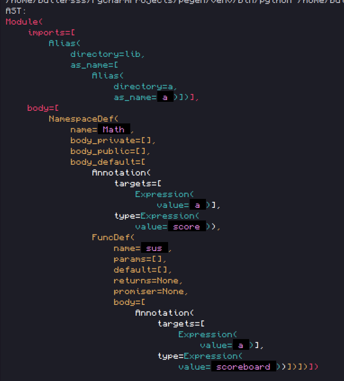

@mainpage Документация для разработчиков

Начало разработки:
- 9 декабря 2022 года

Прежде всего стоит отметить, что качество документации пользователя
и разработчика **сильно отличаются)**

Здесь ожидается больше сусиков и меньше запарных моментов

Ну если вы не ещё не поняли, **Kiwi целиком и польностью будет написан на Python,
НИКАКИХ ЖАБАСКРИПТОВ И ПРОЧИХ ЯЗЫКОВ**.

@htmlonly

<pre class="mermaid" style="float: left; height: 100%">
graph
    0["Лексер pyTokenizer"]
    0 --> 1["Парсер Pegen"]
    1 --> 2["Анализатор"]
    2 --> 3["Байт код преобразователь"]
    3 --> 4["Датапак - иерархия файлов"]
</pre>

@endhtmlonly

# Начнём со структуры всего компилятора

Для разработки Kiwi изначально я полагался только на свои костыльные методы, однако
быстро понял, что неструктурированный код без разделения задач на подзадачи быстро становится
куском кода, к которому притрагиваться становится больно.

Поэтому пошли другим методом, ***НО!***, с другой стороны невозможно
применить польностью такую же структуру как и в реальных языках программирования,
так как у нас блин на выходе не бинарный файл как в каком-нибудь C++, а папка с кучей папок
внутри, разных JSON файлов и.т.д.

*Кароче кратко говоря вы просто должны понять что в итоге есть 5 этапов компиляции, они типа в
виде забумбенного графа изображены*

@htmlonly

@endhtmlonly

Ну типа краткое содержание
---``

**Лексер и Парсер** официально зовутся как ***лексический анализатор*** и ***синтаксический анализатор / парсер***.
(см. в Wikipedia [Лексика](https://en.wikipedia.org/wiki/Lexical_analysis)
а так же [Синтаксис/Парсер](https://en.wikipedia.org/wiki/Parsing)

В итоге вместе они генерят такую фиговинку:

из этого кода:

@kiwicode
namespace Math:
    a: score

    function sus():
        a: scoreboard
@endkiwicode

Согласитесь, эту штуку несложно читать. Она нужна чтобы потом из этого дерева (она так называется
потому что корнями углубляется вглубь, у меня глубина через отступы задаётся) сделать анализ.

Польза от этой штуковины огроменна, благодаря этому дереву вы можете не париться с обработкой ключевых
слов, париться с тем чтобы обрабатывать скобки, отступы и.т.д.

Надеюсь на этом этапе у вас возникло минимум вопросов, потому что с этой фиговиной вам даже работать
не придётся, *можете забить болт*!

**Анализатор** ещё официально называется [семантическим анализом](https://en.wikipedia.org/wiki/Computational_semantics).

И так, проведём аналогию, что **парсером у нас был челик, который сортировал таблички с буковками в структуры деревьев,
в таком случае анализатор это тот самый челик, который будет каждое полученное деревце тщательно
продумывать и проверять в отдельности**.

Как бы так сказать иначе, если парсер проверял что мы правильно поставили слова, то анализатор будет уже
обрабатывать переменные, создавать связи в выражениях. Кароче он главный мозг, который из балды творит чудеса.

Благодаря анализатору вы можете не париться насчёт 

